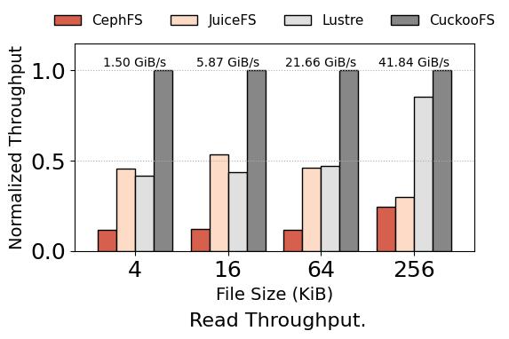
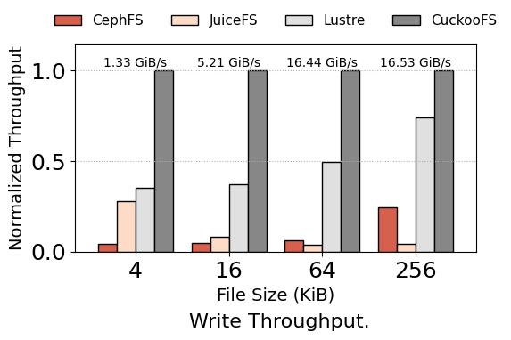
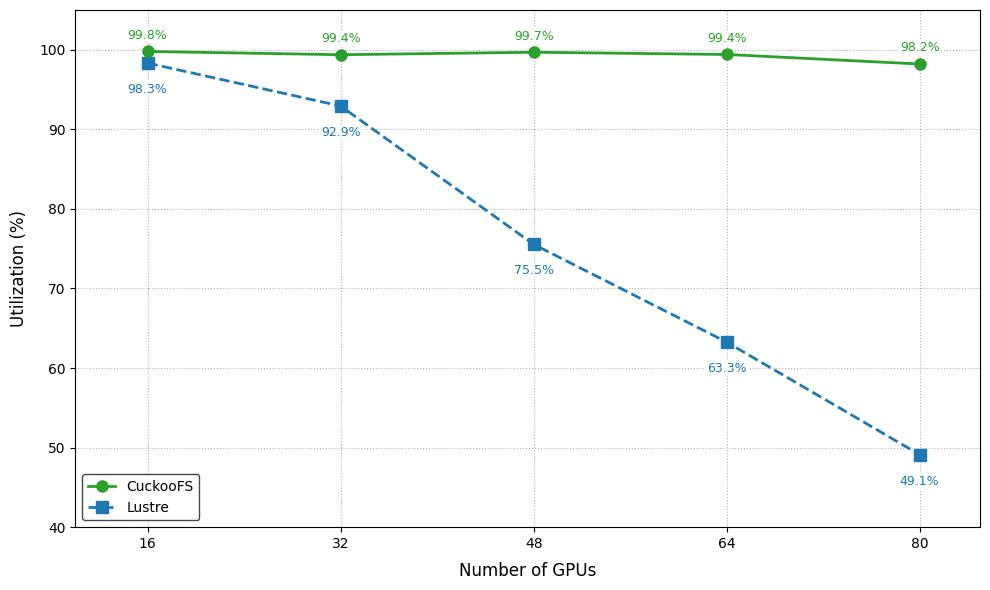

# CuckooFS

[](https://github.com/hw-fsi/cuckoofs/actions/workflows/build.yml)
[](LICENSE)

CuckooFS is a high-performance distributed file system (DFS) designed for AI workloads. It addresses the challenges of handling a huge number of small files in AI workloads through a novel distributed metadata engine. CuckooFS aims to provide extremely high I/O performance by leveraging near-compute DRAM and SSDs and to offer elasticity and cost efficiency by integrating remote cloud object store, making it an ideal solution for modern AI-driven applications. CuckooFS has been deployed in Huawei AI clusters with near 10000 NPUs to accelerate data access during model inference (training data producing) and training for the Huawei Qiankun advanced driving solution (ADS).

## Documents

- [CuckooFS Design](./docs/design.md)
- [Use case: Huawei ADS Deployment](./docs/ads-deployment.md)
- [CuckooFS Cluster Test Setup Guide](./deploy/ansible/README.md)

## Performance

**Test Environment Configuration:**
- **CPU:** 2 x Intel Xeon Gold 5317 3.00 GHz, 12 cores
- **Memory:** 16 x DDR4 2933 MHz 16GB
- **Storage:** 2 x Samsung PM9A3 NVMe SSD 960 GB
- **Network:** 2 x ConnectX-5 Single-Port 100GbE
- **OS:** Ubuntu 20.04 Server 64-bit

> **Note**
> This experiment uses an optimized fuse. The relevant code will be open-sourced later.

We conduct the experiments in a cluster of 13 duel-socket machines, whose configuration is shown above. To better simulate large scale deployment in data centers, we have the following setups:
- First, to expand the test scale, we abstract each machine into two nodes, with each node bound to one socket, one SSD, and one NIC, scaling up the testbed to 26 nodes.
- Second, to simulate the resource ratio in real deployment, we reduce the server resources to 4 cores per node. So that we can:
  - generate sufficient load to stress the servers with a few client nodes.
  - correctly simulate the 4:1 ratio between CPU cores and NVMe SSDs in typical real deployments.
In the experiments below, we run 4 metadata nodes and 12 data nodes for each DFS instance and saturate them with 10 client nodes. All DFSs do not enable metadata or data replication.

**Compared Systems:**
- CephFS 12.2.13.
- JuiceFS 1.2.1, with TiKV 1.16.1 as the metadata engine and data store.
- Lustre 2.15.6.


<br>
<div style="text-align: center;">
    <font size="5">
        <b>Throughput of File data IO.</b>
    </font>
    <br>Y-axis is the throughput normalized to that of CuckooFS. CuckooFS has reached storage hardware bottleneck on 256KiB. Thanks to CuckooFS's higher metadata performance, it outperforms other DFSs in small file access.
For files no larger than 64 KB, {\sys} achieves 7.35--21.23x speedup over CephFS, 0.86--24.87x speedup over JuiceFS and 1.12--1.85x speedup over Lustre.
</div>


<br>

<div style="text-align: center;">
    <font size="5">
        <b>MLPerf ResNet-50 Training Storage Utilization Benchmark.</b>
    </font>
    <br> We simulate training ResNet-50 model on a dataset containing 10 million files, each file contains one 131 KB object, which is a typical scenario for deep learning model training in production. MLPerf has been modified to avoid merging small files into large ones, simulating real-world business scenarios while reducing the overhead associated with merge and copy operations. The CuckooFS client utilizes an optimized FUSE module to minimize overhead, and the module will be open-sourced in the near future. Taking 90% accelerator utilization as the threshold, the CuckooFS instance supports up to 80 accelerators while the Lustre instance can only support 32 accelerators.
</div>



<br>

## Build

suppose at the `~/code` dir
``` bash
git clone https://github.com/hw-fsi/cuckoofs.git
cd cuckoofs
git submodule update --init --recursive # submodule update postresql
./patches/apply.sh
docker run -it --rm -v `pwd`/..:/root/code -w /root/code/cuckoofs ghcr.io/hw-fsi/cuckoofs-dev /bin/zsh
./build.sh
ln -s /root/code/cuckoofs/cuckoo/build/compile_commands.json . # use for clangd
```

test

``` bash
./build.sh test
```

clean

``` bash
cd cuckoofs
./build.sh clean
```

incermental build and clean

``` bash
cd cuckoofs
./build.sh build pg # only build pg
./build.sh clean pg # only clean pg
./build.sh build cuckoo # only build cuckoofs
./build.sh clean cuckoo # only clean cuckoofs
./build.sh build cuckoo --debug # build cuckoofs with debug
```

## Authors

- Junbin Kang
- Lu Zhang
- Mingyu Liu
- Shaohong Guo
- Ziyan Qiu
- Anqi Yu
- Jingwei Xu

## Copyright
Copyright (c) 2025 Huawei Technologies Co., Ltd.
