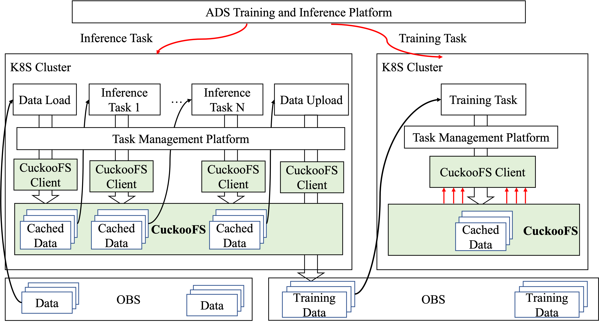

# CuckooFS makes Huawei Qiankun ADS model training and inference faster
Huawei Qiankun ADS (Advanced Driving Solution) trains autonomous driving models from continously collected sensor data from vehicles, which requires massive I/O throughput on billions of files. CuckooFS has been deployed in Huawei ADS clusters with near 10000 NPUs to accelerate data access during model training and training data producing (inference).

As shown in the following figure, CuckcooFS has been used to accelerate ADS training data producing tasks and model training tasks. We will introduce the data flow of these two kinds of tasks in details.

**Inference Task**: Continuously generated sensor data from vehicles are collected and uploads to Huawei Cloud OBS. The load tasks will load the newly generated raw data from OBS to CuckooFS for data preprocessing. After that, there are pre-trained DL models running on NPUs to process the raw images, includes moving objects detection, lane detection, traffic sign detection, etc. These inference tasks read and write the data from/to CuckooFS in a pipeline way, involving massive small file reads and writes and directory lists. At last, the final data (which will be used to train autonomous models) will be uploaded from CuckooFS to the training OBS. The storage performance is critical to the overall inference speed. Compared to using local disks to share data between tasks，CuckooFS enables pipeline tasks to be scheduled within the cluster evenly while offering high cross-server IO throughput, thus **improving overall NPU utilization by 66%**.

**Training Task**: When model training runs in the first epoch, data is first loaded into CuckooFS from OBS. Thus, in the following epoches, training tasks can access the training data from CuckooFS in a ultra-fast way. Compared with model training directly on OBS, **CuckooFS can improve the end-to-end training performance by 1.5X**.

## Copyright
Copyright (c) 2025 Huawei Technologies Co., Ltd.
